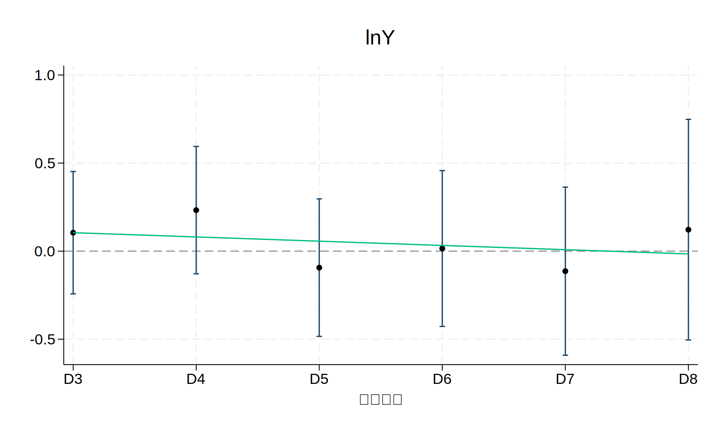
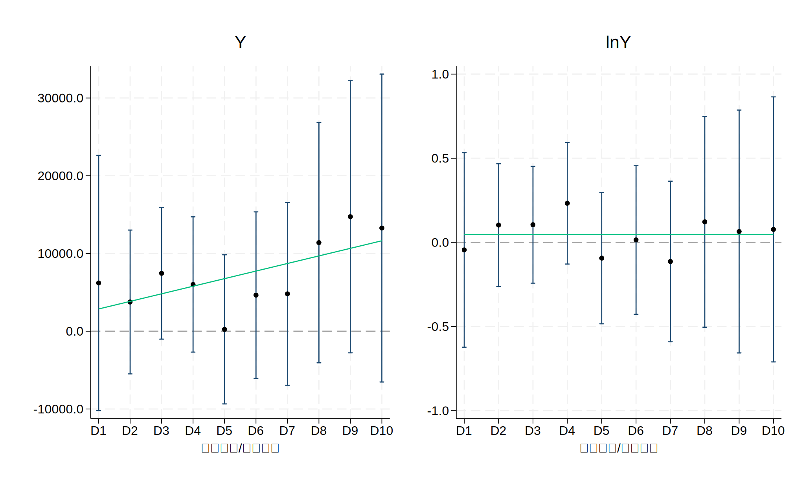
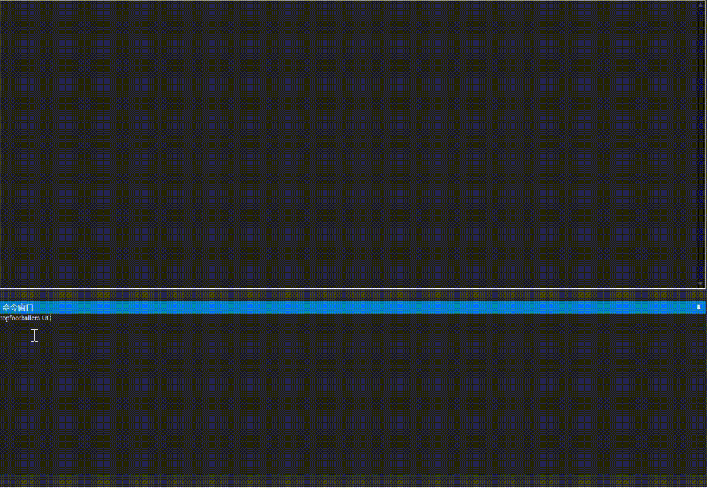
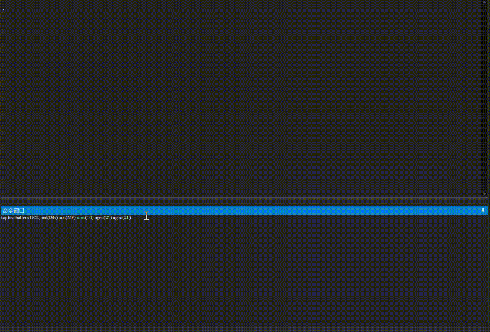

### Command Programming
I have developed several commands based on my own interests or in other words, entertainment. Some of them originated from my workflows and other stemmed from pure interests.  

Creating a customized automatic progress helps encapsulate my empirical work and improve efficiency.  
##### DRAWREGS: Visualize the Regression Coefficients
**drawregs** is developed because I was totally tired of giant tables and forms requested by the same regressions which contains different dummies by order. To be more specific, it is used to create graphs for the regressions containing dummies with continuous economic features.  
    
  

The "continuous economic feature" mentioned above encompasses two dimensions: Space and Time. Imagine a scenario: we aim to create several dummy variables representing temporal/spatial nodes (which form the complete temporal/spatial investigation scope when connected) to assess the impact of a single time/space point on our dependent variable. For instance, does t5 have a greater influence on Y compared to t1 and t2? Is the causal effect most significant at nkm2 ?

When encountered this difficulty in the empirical section of my graduation thesis, I wrote a few simple lines of code to visualize the estimation of coefficients and found the results to be satisfactory. I hoped to "encapsulate" this "function" for the potential use of others or for future needs if exist.  

Below is the full syntax of the command.  
```Stata
drawregs /// **needs stata version18
  your_dependent_variable, /// **the dependent variable
  startnum(n) /// **the start number, mandatory
  endnum(n+i) /// **the end number, mandatory
  xtitle(string_text) /// **the X-axis title, optional
  cv(numeric_varlist) /// **the list of control variables
```
The images below demonstrate the effect of the command.

<table>
  <tr>
    <td></td>
    <td></td>
  </tr>
</table>

You can find the process of programming as well as more details in my [Wechat public post: 𝐒𝐓𝐀𝐓𝐀×可视化 | 厌倦了庞大表格？为虚拟变量的回归系数创建可视化图形](https://mp.weixin.qq.com/s/zivJLL6tqRkcjsNDRkx3Wg).
##### TOPFOOTBALLERS:
**Topfootballers** is a Stata command created independently by the author.  
It is designed to instantly crawl real-time data of top football players and display the information based on user-defined parameters for conditional filtering.

  

Below is the **basic syntax** of the command.
```Stata
topfootballers league_name
```
The images below demonstrate the effect of the command.
```Stata
** If you run this command:
topfootballers UCL
```

  

Below is the **full syntax** of the command.
```Stata
topfootballers league_name, ind() pos() rank() ageo() ageu() 
```
The images below demonstrate the effect of the command.
```Stata
** If you run this command:
topfootballers UCL, ind(Gls) pos(MF) rank(10) ageu(21) ageo(21)
** To find data on midfielders who is 21-year-old and rank in the top 10 for goals scored in the UEFA Champions League
```

  

You can find the process of programming as well as more details in my [Wechat public post: 𝐒𝐓𝐀𝐓𝐀×实况足球｜跑回归时球瘾犯了，如何调理？—— 基于极简易爬虫及文本分析的解决方案](https://mp.weixin.qq.com/s/F0G4zVV11kcRU4pt7ghDpw).  

  


